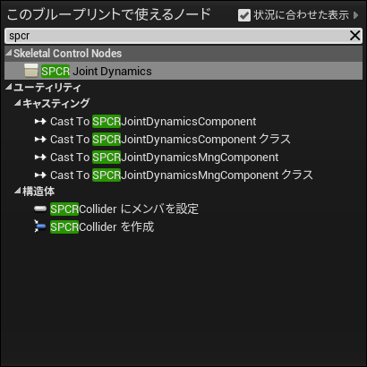
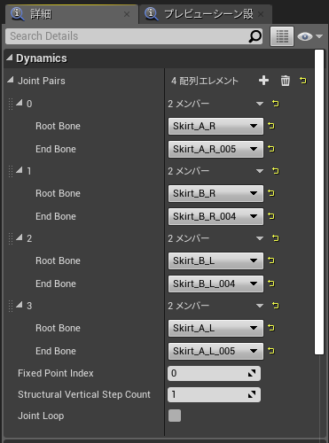
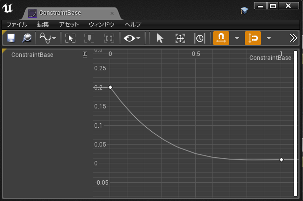
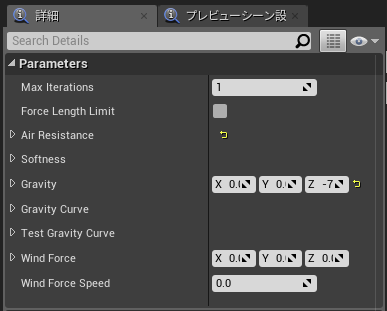
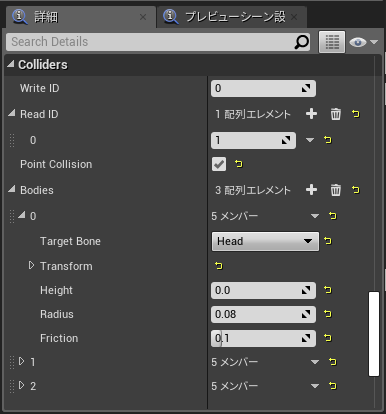
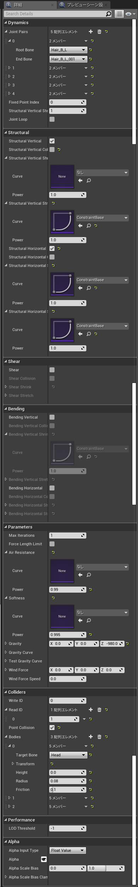

# SPCRJointDynamics for UE4
布風骨物理エンジン  

## 概要
骨間で布物理のようなシミュレーションを行うためのものです。  

* UNREAL ENGINE 4.21~にて動作確認  

## License
* [MIT License](./LICENSE)  

## 開発目的
足がスカートを貫通するのを何とかして綺麗に広がるスカートを作ってみたい  
※Unity版 https://github.com/SPARK-inc/SPCRJointDynamics  
  

## 基本仕様
クロスシミュレーションのアルゴリズム（Mass-spring-damper model）をそのまま流用して骨を動かしています。  
スカートや髪の毛などで使いやすいように物理的な正しさとかよりも見た目のそれっぽさを優先して組んであります。  
骨が綺麗に並んでいるケースばかりではないので数がずれていても拘束を作りに行くようになっています。  
  
* 各拘束の意味
  

## 事前準備
  
プラグインはAnimBPとして実装されていますので、AnimBPのグラフ上でノードを呼び出してください。  
あとはパラメーターを設定してノードを繋ぐことで動くようになります。  
  
## 使い方
### 骨の基本的な設定
  
「親の先端の骨→子の終端の骨」を１つのペアとして設定することでその間の骨が鎖として繋がれます。  
「Dynamics」プロパティの「Joint Pairs」のそれらの設定をしていきます。  
  
「Fixed Point Index」は先端からの固定される骨のインデックスです。  
通常は0で先端だけ固定されますが、何らかの用途でいくつかの骨を固定したい場合に使います。
  
「Structural Vertical Step Count」は構造拘束の垂直方向のシミュレーションの回数です。  
多いほど安定しますがループが回るので重くなります。
  
「Joint Loop」は「Joint Pais」の最初と最後をループして繋ぐかどうかを指定します。  
スカートのように円環上の構造であればチェックを入れる必要があります。  
逆にマントのように両端がつながる必要がない場合はチェックを入れません。  
  
### 骨間の拘束の設定
  
上記で設定した骨の処理に対して拘束のパラメーターを設定します。  
  
拘束の設定は大きく分けて３種類あり、  
「Structural」構造を構成するための拘束で最も基本的な骨どうしの鎖のような拘束がこれに当たります。  
「Shear」構造を構成するための拘束で歪みの対する拘束を設定します。この拘束がない場合は捻じれやすくなります。  
「Bend」構造を構成するための拘束で曲げに対する拘束を設定します。この拘束がない場合は曲がりやすくなります。
  
各拘束にはそれぞれパラメーターで拘束力が設定できるようになっています。  
基本的には先端ほどきつく、末端ほど緩くすることで滑らかな動きになりやすくなります。  
サンプルで使用している拘束のカーブは以下のように設定されています。  
  
布や髪の毛などのよくつかわれるものには通常は垂直構造の伸びた時の復元力は1.0を指定するのが望ましいです。  
この構造の拘束力が弱い場合はゴムのように伸びるようになります。  
  
各拘束についている「Collision」のチェックボックスは関連するコライダーとの当たり判定を行うかどうかになります。  
拘束処理が行われる場合でもこのチェックがない場合はコリジョンの処理は行われませんん。  
  
例えば髪の毛のような場合では基本的な構造拘束にのみコリジョンの処理をONにして、  
ShearやBendの拘束は形状を維持するためだけに利用するといった感じで使ったりします。  
  
### その他のパラメーターの設定
  
「Max Iterations」全体の処理の繰り返し回数です。  
数が大きいほど全体の処理が安定しますが重くなります。  
  
「Force Limit Length」長さが変わることを許容しないようになります。  
是が非でも骨の長さを一定にする場合に使います。  
  
「Air Resistance」空気抵抗の値になります。1.0で空気抵抗が完全無視になります。  
かなり値にシビアで0.98とかの値をいれて使います。  
  
「Softness」柔らかさの値になります。0.0で完全に変形しない状態になります。  
こちらも0.98とかの値をいれることでソフトボディ的な感じになります。  
  
「Gravity」重力値になります。  
  
「Wind Force」風のパラメーターになります。
  
### コリジョン関連の設定
  
「Write ID」ここで設定したコリジョン情報「Bodies」の内容を他のノードから参照できるようにグローバルなIDを指定します。  
  
「Read ID」ほかのノードの指定されたグローバルなIDが割り振られたコリジョン情報を参照します。  
今回の例では「足のコライダーを設定するノードが最初に処理されて、そのノードで作られたコライダーをスカートのノードとリボンのノードで参照する。」といった感じで利用します。  
別のスケルトンに対しても有効ですので体と頭部が別のスケルトンになっているときに、体のコライダーの情報を髪の毛のスケルトンのBPで参照することができます。  
  
「Point Collision」拘束を構成する線分ではなく、拘束の点でコリジョン判定をします。  
処理は軽くなりますが、骨の密度が薄かったりコライダーが小さい場合は抜けます。  

「Bodies」コライダーです。Height値が0.0の場合は球として扱われます。  
  
## パラメーター一覧
  
  
## その他
UE4自体の扱いがそんなに得意ではないため割と無理やりな箇所があります。  
UE4的にいけてる書き方とか実装方法があったら教えてください。
